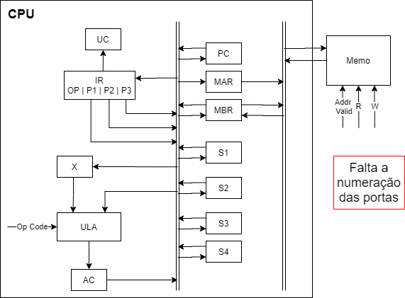
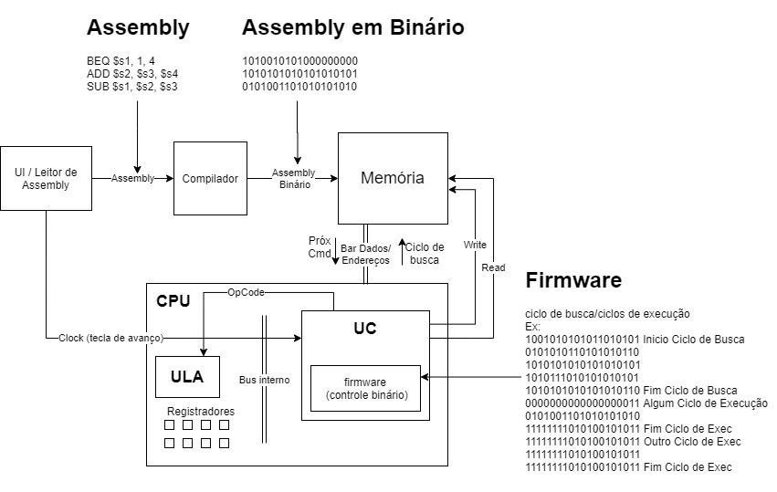

# MipsCompiler
Compilador de comandos Mips em C#

Ponto Principal de início: definir a sintaxe de correspondência entre Assembly e Binário 
(é interessante o binário corresponder ao firmware de certa forma, na relação entre Registrador e as portas correspodentes)

<h2>Diagrama da CPU</h2>

<h2>Diagrama do Interpretador</h2>

